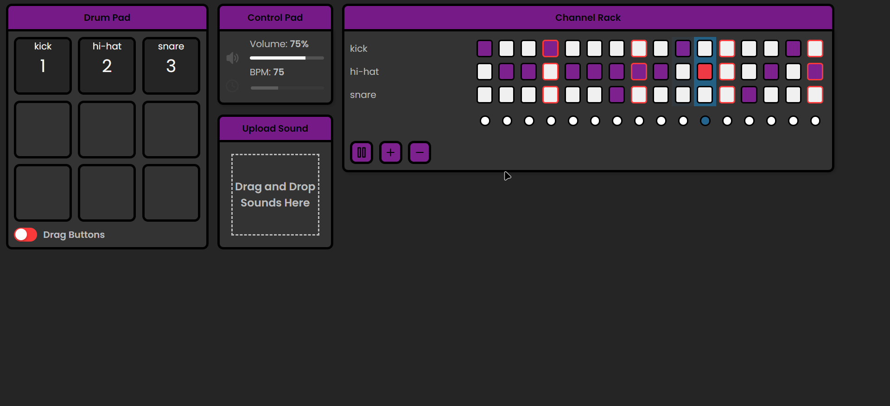

# 🎵 Sound Sandbox 🎵
[Try it here (Github Pages)](https://oriolmontcreus.github.io/vanilla-audio-sandbox/)

Sound Sandbox is an interactive web application that allows users to create and manipulate sounds in a fun and intuitive way.

## 🌟 Features

- **🥁 Drum Pad**: The application includes a drum pad that can be used to play different sounds. Each pad corresponds to a different sound and can be triggered by clicking on it or pressing the corresponding key on the keyboard.

- **📤 Sound Upload**: Users can upload their own audio files to be used in the drum pad. The application supports all audio file types.

- **🎛️ Channel Rack**: The channel rack allows users to sequence sounds in a grid-like interface. Each row corresponds to a different sound and each column corresponds to a different point in time.

- **🎮 Control Pad**: The control pad allows users to control the playback of the sounds sequenced in the channel rack.

## 🚀 Getting Started

To get started with Sound Sandbox, it's recommended to use the [Live Server](https://marketplace.visualstudio.com/items?itemName=ritwickdey.LiveServer) extension in Visual Studio Code. After installing the extension, right-click on the `index.html` file and select "Open with Live Server". This will open your default web browser and run the application.

## 🛠️ Technologies Used

| Technology | Description | Link |
| --- | --- | --- |
| HTML | Used for structuring the web content. | [Learn More](https://developer.mozilla.org/en-US/docs/Web/HTML) |
| CSS | Used for styling the web content. | [Learn More](https://developer.mozilla.org/en-US/docs/Web/CSS) |
| JavaScript | Used for creating interactive web content. | [Learn More](https://developer.mozilla.org/en-US/docs/Web/JavaScript) |
| jQuery UI | A curated set of user interface interactions, effects, widgets, and themes built on top of the jQuery JavaScript Library. | [Learn More](https://jqueryui.com/) |
| js-snackbar | A simple, lightweight JavaScript library for displaying snackbars. | [GitHub Repository](https://github.com/mickelsonmichael/js-snackbar/) |

## 📸 Preview

  
   
  
   

  
   

https://github.com/oriolmontcreus/vanilla-audio-sandbox/assets/58004352/dfad9d59-2b18-4a63-8635-792568cc1f27

